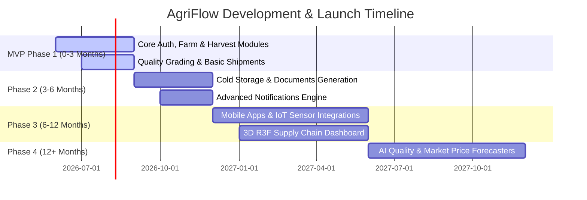

# AgriFlow: Product Strategy, Commercialization & Roadmap

This document outlines the product analysis, commercialization framework, and development roadmap for AgriFlow.

---

## 1. Product Analysis

### Executive Summary
AgriFlow is a vertically integrated B2B SaaS platform that digitizes the complete agricultural export supply chain. By replacing fragmented workflows (managed via spreadsheets, WhatsApp, and paper logs) with a unified digital ecosystem, AgriFlow brings trust, traceability, and operational efficiency to farm operations, packhouse management, cold chain logistics, and international commerce.

#### Core Value Proposition
* **End-to-End Traceability**: Map every carton of produce back to the exact block of land, harvest date, and quality inspection report, resolving buyer disputes instantly.
* **Operational Efficiency**: Eliminate double entry, reduce documentation errors by 50%, and slash container tracking time from hours of manual calls to real-time status boards.
* **Financial Integrity**: Real-time export margin analysis tracking harvest, packaging, storage, logistics, and port costs against order revenues.

#### Business Impact
* **Exporters**: Higher margins through lower crop wastage, faster document processing, and reduced transit spoilage.
* **Buyers**: Higher trust, guaranteed phytosanitary compliance, and live ETA updates.
* **Farmers**: Secure purchase orders, predictable cash flow, and visibility into grade-based yield payments.

---

### Market Analysis
Global agricultural trade is valued at over $2 trillion. However, the export supply chain remains highly fragmented, relying on localized legacy operations.

#### Market Opportunity
Exporters in developing regions (such as India, Southeast Asia, and Latin America) are scaling exports of high-value crops (Bananas, Grapes, Pomegranates, Mangoes) to demanding markets (Europe, Middle East, US). These exporters face strict import regulations (MRLs, Phytosanitary certification) and cannot scale using traditional manual tracking methods.

#### Competitive Landscape
* **Legacy ERPs (SAP NetSuite, Oracle Fiori)**: High setup cost ($100k+), complex user experience, and lack of specialized farm-level or temperature-tracking modules.
* **Farm Management Apps (Cropin, FarmLogs)**: Excellent at agronomy but lack logistics, container tracking, export documentation, and buyer CRM features.
* **Freight Tech Platforms (Flexport, Shippeo)**: Strong logistics tracking but blind to packhouse operations, quality grading parameters, and farm-level traceability.
* **AgriFlow's Competitive Advantage**: Integrated vertically from farm soil to container delivery, tailored specifically for high-value agricultural export workflows.

---

### SWOT Analysis

| Strengths (S) | Weaknesses (W) |
| :--- | :--- |
| • Complete vertical integration (soil to ship).<br>• In-app document generation reducing customs friction.<br>• Native IoT temperature sensor logs.<br>• High-fidelity 3D visualization for buyers. | • Initial high setup friction for manual farm data entry.<br>• Reliance on physical mobile networks in remote rural farms.<br>• Custom integrations required for varying global port systems. |
| **Opportunities (O)** | **Threats (T)** |
| • Integration of AI-driven yield and price predictions.<br>• FinTech opportunities: Pre-shipment trade financing.<br>• Integration with regional single-window customs systems (e.g., ASYCUDA). | • Volatile global trade policies and tariff fluctuations.<br>• Extreme weather events destroying seasonal crop yields.<br>• Rapid entry of low-cost localized SaaS clones. |

---

### Risks & Mitigation

| Risk Type | Identified Risk | Mitigation Strategy |
| :--- | :--- | :--- |
| **Technical** | IoT sensor failure or lack of network connectivity in rural farms. | Implement local SQLite storage in mobile clients for full offline capability; sync with PostgreSQL database once internet connectivity is restored. |
| **Operational** | Resistance from packhouse workers and farm labor to adopt digital logs. | Design high-density, minimal-touch mobile UI screens with large scan targets (QR/Barcodes) and localized languages. |
| **Adoption** | Exporters hesitant to migrate historical spreadsheets to a new platform. | Provide automated Excel/CSV importers for farms, buyers, historical logs, and inventory data. |
| **Compliance** | Changing MRL (Maximum Residue Limits) and phytosanitary rules across export destinations. | Maintain an auto-updating global compliance rules engine flagging batches that exceed target country residues. |

---

## 2. Identified Gaps in PRD & Recommendations

Our architectural review of the initial PRD identified key functional gaps that are critical for an enterprise-ready system. We recommend incorporating the following enhancements:

### Gap 1: Multi-Currency & FX Hedging
* **Problem**: Agricultural exports operate across multiple currencies (e.g., Exporter incurs costs in INR/PHP, invoices Buyer in USD/EUR). Daily exchange rate fluctuations can destroy margins.
* **Recommendation**: Integrate real-time exchange rate APIs (e.g., OpenExchangeRates) into the Revenue Analytics module and allow locked-in exchange rate fields for purchase orders.

### Gap 2: Target Country Compliance (MRL Engine)
* **Problem**: A shipment of grapes can be rejected at Rotterdam Port if chemical residue levels exceed EU Maximum Residue Limits (MRL), causing total loss.
* **Recommendation**: Link the Quality Grading Center to a destination-based MRL database. Ensure the inspection checklist dynamically adjusts based on the order's destination country.

### Gap 3: Demurrage & Detention Alerting
* **Problem**: Exporters lose thousands of dollars daily when containers sit at ports past their free-time allowance (demurrage/detention).
* **Recommendation**: Add container free-time configuration fields in the Shipment module, with progressive system alerts triggered 48 hours prior to demurrage penalties.

### Gap 4: Offline-First Native Support
* **Problem**: Packhouse and farm operations managers frequently operate in steel-clad cold storage rooms or remote valleys with zero network coverage.
* **Recommendation**: Develop a lightweight Progressive Web App (PWA) with a Service Worker caching layer, synchronizing via a background queue.

---

## 3. SaaS Commercialization Strategy

AgriFlow operates on a hybrid B2B SaaS subscription model combined with transactional fees for premium integrations.

### Subscription Tiers

```
+-------------------------------------------------------------------------------------------------+
|                                     SUBSCRIPTION TIERS                                          |
+------------------------------------+--------------------------------+---------------------------+
|               GROWER               |         GLOBAL EXPORTER        |        ENTERPRISE         |
|         $149/month (Billed Annually) |         $899/month (Billed Annually) |       Custom Contracting  |
|                                    |                                |                           |
| Best for single-farm operators.    | Best for scaling export houses. | Best for multi-national   |
|                                    |                                | agricultural conglomerates|
| - Up to 5 Farms                    | - Unlimited Farms              | - Multi-tenant Accounts   |
| - Basic Harvest & Quality Logs     | - Complete Cold Chain Logistics| - Custom SLA Agreements   |
| - Excel Reports Export             | - Automated Document Generator | - Ded. Solutions Architect|
| - 5 User Seats                     | - 3D Supply Chain Dashboard    | - On-Premises DB Option   |
| - Email Support                    | - 50 User Seats                | - SSO (SAML/OIDC) Auth    |
+------------------------------------+--------------------------------+---------------------------+
```

### Premium Revenue Add-ons
1. **IoT Sim Connectivity Fee**: $15/sensor/month for live temperature/humidity tracking.
2. **Fintech Clearing Fee**: 0.5% fee on payments cleared through Razorpay/Stripe with built-in export credit insurance.
3. **Marketplace Commissions**: 1.5% transaction commission on orders placed via the integrated buyer-seller matching portal.

---

## 4. Product Roadmap



### Detailed Breakdown

#### MVP Phase (0–3 Months): Core Foundation
* **Focus**: Establish database schema, web platform, crop inventory, farm tracking, grading center, and exporter workflow.
* **Core Team**: 1 PM, 1 Tech Lead, 1 Frontend Engineer, 2 Backend Engineers, 1 UX Designer.
* **Effort / Budget Estimate**: ~18 Person-Months | **Budget**: $150,000 USD.

#### Phase 2 (3–6 Months): Operations & Compliance
* **Focus**: Cold storage logs, automated export PDF generators, multi-currency revenue analytics, and system notifications.
* **Core Team**: 1 PM, 2 Frontend, 2 Backend, 1 QA.
* **Effort / Budget Estimate**: ~18 Person-Months | **Budget**: $160,000 USD.

#### Phase 3 (6–12 Months): IoT & Immersive UX
* **Focus**: Native PWA mobile app, live BLE/cellular temperature sensor integrations, and React Three Fiber 3D interactive viewer.
* **Core Team**: 1 PM, 1 Three.js Specialist, 2 Mobile Developers, 2 Backend, 1 IoT Architect.
* **Effort / Budget Estimate**: ~42 Person-Months | **Budget**: $380,000 USD.

#### Phase 4 (12+ Months): AI Engine & Scale
* **Focus**: Computer vision quality classification, machine learning-driven yield and route optimization models, and marketplace integrations.
* **Core Team**: 1 PM, 2 Data Scientists, 2 Backend, 1 Data Engineer.
* **Effort / Budget Estimate**: ~36 Person-Months | **Budget**: $400,000 USD.

---

Proceed to the next document to view authorization patterns and data mapping: **[02. User Journey & RBAC Matrix](file:///Users/0mrajput/Desktop/hoilday projects /AgriFlow/02_user_journey_rbac.md)**.
