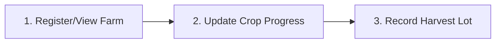
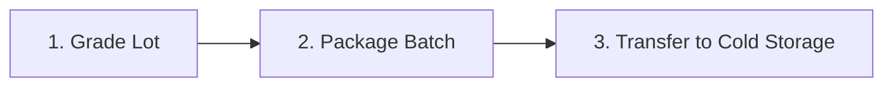
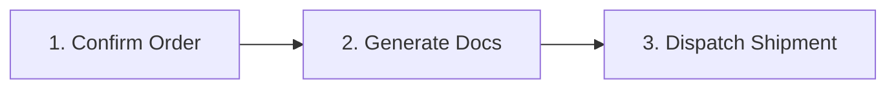
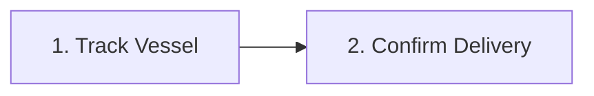

# AgriFlow: Role-Based Access Control (RBAC) & User Journeys

This document defines the roles and permissions matrix, platform information architecture, and user journey mapping.

---

## 1. Role-Based Access Control (RBAC) Matrix

AgriFlow enforces strict Role-Based Access Control to maintain data security and partition duties between farmers, operations teams, exporters, and buyers.

### Permissions Definition
* **View (V)**: Read records.
* **Create (C)**: Add new entries.
* **Edit (E)**: Modify existing entries (non-destructive).
* **Delete (D)**: Destroy records (typically soft-delete).
* **Approve (A)**: Sign off on compliance, quality, or financial release.
* **Export (X)**: Download CSV/PDF documents or sync data externally.

### Matrix Table

| Module | Farmer | Operations Manager | Exporter (Export Mgr) | Buyer | Administrator |
| :--- | :--- | :--- | :--- | :--- | :--- |
| **Farms** | V (Assigned)<br>E (Assigned Crop) | V / C / E | V | — | V / C / E / D / A / X |
| **Crop Inventory** | V (Assigned) | V / C / E | V / E (Allocation) | — | V / C / E / D / A / X |
| **Harvests** | V / C / E (Assigned) | V / C / E / A | V | — | V / C / E / D / A / X |
| **Quality Grading** | V (Assigned Lot) | V / C / E / A | V / X | — | V / C / E / D / A / X |
| **Packaging** | — | V / C / E | V | — | V / C / E / D / A / X |
| **Cold Storage** | — | V / C / E / A | V | — | V / C / E / D / A / X |
| **Logistics** | — | V / C / E | V / C / E | V (Assigned ETA) | V / C / E / D / A / X |
| **Shipments** | — | V (Loading status) | V / C / E / A / X | V (Assigned) | V / C / E / D / A / X |
| **Documentation** | — | — | V / C / E / A / X | V (Approved only) | V / C / E / D / A / X |
| **Buyers CRM** | — | — | V / C / E / A / X | V (Own Profile) | V / C / E / D / A / X |
| **Revenue Analytics** | — | — | V / C / E / X | — | V / C / E / D / A / X |
| **Market Intelligence** | V | V | V | — | V / C / E / D |
| **Notifications** | V / E (Own preferences) | V / E (Own preferences) | V / E (Own preferences) | V (Own only) | V / C / E / D / A |
| **Organization Settings**| — | — | V (Read Org details) | — | V / C / E / D |

---

## 2. Complete User Journey Mapping

Below are the step-by-step user journey maps tracking actions, screen pathways, database records generated, system alerts, and primary business KPIs.

### A. Farmer Journey: Farm → Crop → Harvest



| Step | User Action | Screen | Data Generated | Notifications Triggered | KPIs Impacted |
| :--- | :--- | :--- | :--- | :--- | :--- |
| **1. View Farm** | Select assigned farm block and review expected yield forecast. | **Farm Details Page** | Active session log. | None. | • Active Farms tracking. |
| **2. Update Crop** | Input crop growth stage (e.g., flowering, bagging) and expected harvest window. | **Crop Input Form** | `crop_cycles` status update, expected yield adjust. | None. | • Crop Health Index<br>• Forecast Accuracy |
| **3. Record Harvest** | Log harvested weight, team, and seal lot. Generate barcode label. | **Create Harvest Page**| New record in `harvests` (lot number, actual weight, timestamp). | In-app alert to Operations Manager: *"Harvest Lot LOT-XYZ ready for inspection"* | • Actual Yield vs. Target<br>• Harvest Velocity |

---

### B. Operations Journey: Harvest → Quality → Packaging → Storage



| Step | User Action | Screen | Data Generated | Notifications Triggered | KPIs Impacted |
| :--- | :--- | :--- | :--- | :--- | :--- |
| **1. Grade Lot** | Scan harvest lot QR code, input size, weight, defect parameters, and assign grade. | **Batch Grading Screen**| `quality_reports` record (Grade A/B/C/Rejected, Quality Score). | Email/SMS to Exporter: *"High-grade Lot LOT-XYZ graded A, ready for allocation"* | • Quality Rejection Rate<br>• Grade A yield % |
| **2. Package Batch** | Scan approved quality lot, allocate to cartons, select packing type, and seal batch. | **Packaging Order Details**| `packaging_batches` record (batch number, box count, packing type). | None. | • Packhouse Output Rate<br>• Packaging Cost per Kg |
| **3. Storage Transfer**| Scan packed batch barcode, assign to rack position, configure temp threshold. | **Cold Storage Detail Page** | `storage_allocations` & `temp_humidity_logs` baseline. | Temperature alerts active (triggers SMS if deviation > ±1.5°C). | • Storage Capacity Util %<br>• Temperature Deviations |

---

### C. Export Journey: Order → Documentation → Shipment → Delivery



| Step | User Action | Screen | Data Generated | Notifications Triggered | KPIs Impacted |
| :--- | :--- | :--- | :--- | :--- | :--- |
| **1. Confirm Order** | Link buyer purchase order, select storage batches, allocate inventory. | **Order Creation Form**| `orders` record (reserved quantities, unit pricing, payment terms). | Email to Buyer: *"Order ORD-102 confirmed, packaging initiated"* | • Order Backlog Volume<br>• Reserved Inventory |
| **2. Generate Docs** | Auto-generate Invoice, Packing List, Phytosanitary Certificate, and BL drafts. | **Document Vault / Workflow**| `documents` record (PDF blobs, version control status). | In-App request to Export Manager: *"Customs documents require approval"* | • Document Error Rate<br>• Admin processing time |
| **3. Dispatch** | Assign container number, log shipping vessel, select logistics route and vehicle. | **Shipment Dashboard** | `shipments` (carrier details, live port tracker active). | Email to Buyer with tracking link: *"Container CON-889 dispatched to Port"* | • On-Time Dispatch %<br>• Logistics Transit Cost |

---

### D. Buyer Journey: Order → Tracking → Delivery Confirmation



| Step | User Action | Screen | Data Generated | Notifications Triggered | KPIs Impacted |
| :--- | :--- | :--- | :--- | :--- | :--- |
| **1. Track Vessel** | View container shipping route map, check current port status and ETA. | **Buyer Portal Dashboard** | Geolocation read requests. | Automated push notification on arrival: *"Container has arrived at destination port"* | • Delivery Performance SLA<br>• Live Tracking usage |
| **2. Confirm Delivery** | Mark shipment as received, input visual quality feedback, clear payment. | **Shipment Delivery Screen** | `buyer_feedbacks` record, Razorpay payment status: `COMPLETED`. | Slack/Email alert: *"Payment of $24,500 received for ORD-102"* | • Buyer Satisfaction Score<br>• Day Sales Outstanding (DSO) |

---

## 3. Information Architecture

Below is the platform map showing the navigation hierarchy and panel views.

### Navigation Tree

```
Platform Root (AgriFlow Workspace)
├── 🔐 Authentication (Login, PW Reset, Invite Accept)
├── 📊 Global Search Bar (Universal Search overlay)
├── 📈 Executive Command Dashboard
├── 🚜 Farm Operations Hub
│   ├── Farms (List View, Map View, Details Panel)
│   ├── Harvests (Scheduling Calendar, Live Input Logs, Variance Charts)
│   └── Crop Inventory (Allocation Grid, Reservable Matrix, Crop list)
├── 📦 Packhouse & Storage Hub
│   ├── Quality Grading Center (Inspections Board, Grading Form)
│   ├── Packaging Management (Carton Inventory, Batch Builders)
│   └── Cold Storage (Facility Temperature Grid, Rack Allocation Maps)
├── 🚢 Global Logistics & Export Hub
│   ├── Logistics Route Planner (Dispatch logs, Vehicle details)
│   ├── Shipments (Container boards, Vessel trackers, Custom logs)
│   └── Documents Vault (Legal Repository, Multi-stage Approval Flow)
├── 🤝 B2B CRM & Financial Hub
│   ├── Buyers Directory (Buyer profiles, Payment history)
│   ├── Revenue & Profit Analytics (Gross/Net Profit charts, Expense logs)
│   └── Market Intelligence (Live Agri price index, Country portals)
├── 🔔 System Center
│   ├── Notification Center (Inbox, Priority Alerts settings)
│   └── Settings Panel
│       ├── Organization Profile (Multi-tenant config)
│       └── User Management & RBAC Permissions
```

---

Proceed to the design and layout definitions: **[03. Design System & Screen UX Spec](file:///Users/0mrajput/Desktop/hoilday projects /AgriFlow/03_design_system_ux.md)**.
