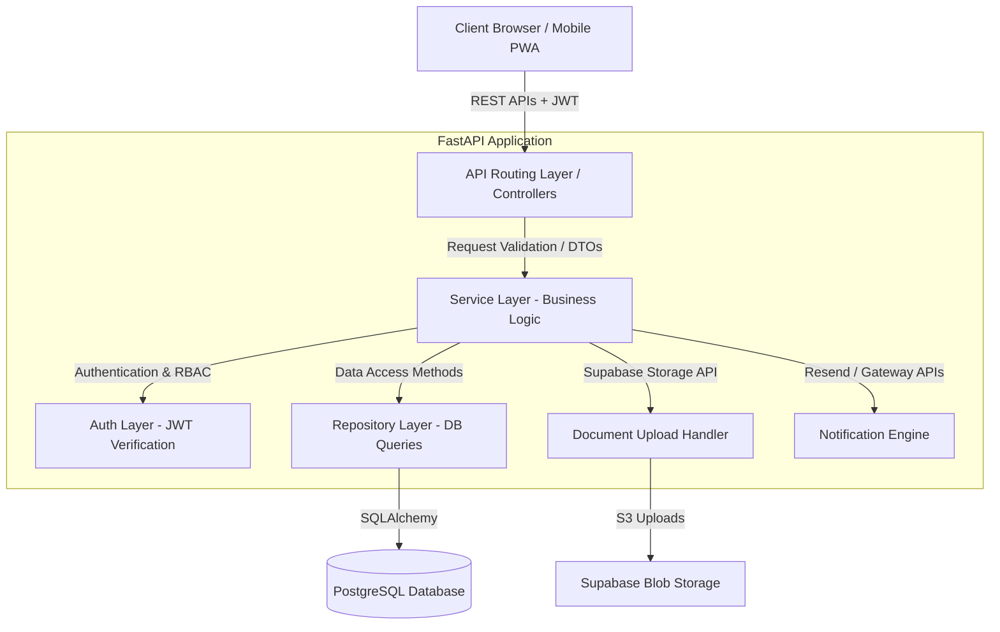
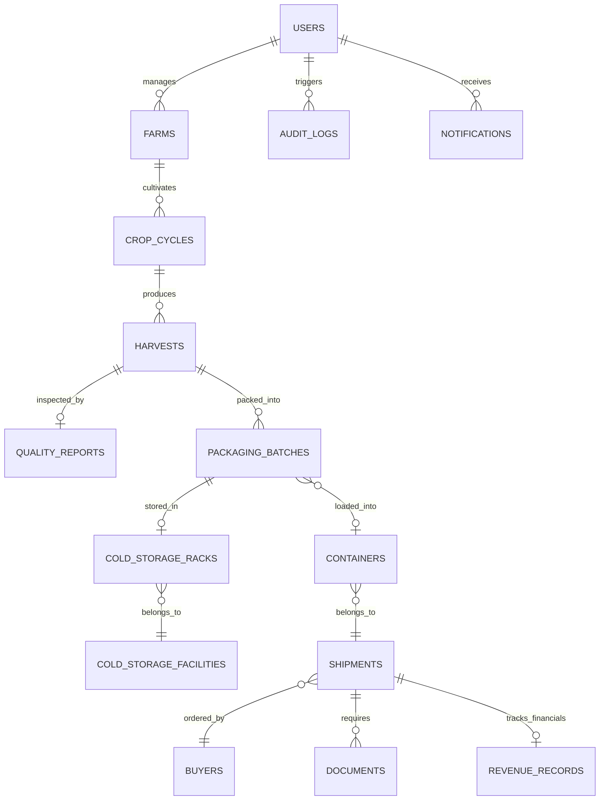

# AgriFlow: Technical Architecture & Database Design

This document covers the technical architecture, complete database schema, ERD, and REST API designs.

---

## 1. System Architecture Design

AgriFlow utilizes a clean-architecture backend following a layered Service-Repository pattern written in **FastAPI** with **SQLAlchemy ORM** and **PostgreSQL**.

### Backend Architectural Layering



* **API Layer**: Handles endpoint routing, request parsing, HTTP status responses, and validation via Pydantic schemas.
* **Service Layer**: Pure business logic execution (e.g., calculating margins, evaluating MRL compliance limits, triggering document generation pipelines).
* **Repository Layer**: Encapsulates all raw SQLAlchemy queries, database access, transaction isolation, and sorting/filtering logic.

---

## 2. Entity Relationship Diagram (ERD)

The following Mermaid diagram visualizes the relational schema and cardinality mappings between the database entities.



---

## 3. Database Architecture (PostgreSQL DDL)

Here is the complete, production-ready PostgreSQL DDL script, including all tables, primary/foreign keys, check constraints, default values, and indexes.

```sql
-- AgriFlow Core Database Schema DDL

-- Enable UUID extension for robust distributed identifiers
CREATE EXTENSION IF NOT EXISTS "uuid-ossp";

-- 1. Users Table
CREATE TABLE users (
    id UUID PRIMARY KEY DEFAULT uuid_generate_v4(),
    name VARCHAR(255) NOT NULL,
    email VARCHAR(255) UNIQUE NOT NULL,
    password_hash VARCHAR(255) NOT NULL,
    role VARCHAR(50) NOT NULL CHECK (role IN ('farmer', 'operations_manager', 'exporter', 'buyer', 'administrator')),
    created_at TIMESTAMP WITH TIME ZONE DEFAULT CURRENT_TIMESTAMP,
    updated_at TIMESTAMP WITH TIME ZONE DEFAULT CURRENT_TIMESTAMP
);
CREATE INDEX idx_users_email ON users(email);

-- 2. Farms Table
CREATE TABLE farms (
    id UUID PRIMARY KEY DEFAULT uuid_generate_v4(),
    name VARCHAR(255) NOT NULL,
    location VARCHAR(255) NOT NULL, -- GPS or city text
    boundary_polygon GEOMETRY(Polygon, 4326), -- PostGIS boundary mapping
    owner_id UUID NOT NULL REFERENCES users(id) ON DELETE RESTRICT,
    created_at TIMESTAMP WITH TIME ZONE DEFAULT CURRENT_TIMESTAMP,
    updated_at TIMESTAMP WITH TIME ZONE DEFAULT CURRENT_TIMESTAMP
);
CREATE INDEX idx_farms_owner ON farms(owner_id);

-- 3. Crop Cycles Table
CREATE TABLE crop_cycles (
    id UUID PRIMARY KEY DEFAULT uuid_generate_v4(),
    farm_id UUID NOT NULL REFERENCES farms(id) ON DELETE CASCADE,
    crop_type VARCHAR(100) NOT NULL CHECK (crop_type IN ('banana', 'grapes', 'pomegranate', 'onion', 'mango', 'other')),
    area_acres NUMERIC(10, 2) NOT NULL CHECK (area_acres > 0.00),
    expected_yield_tons NUMERIC(10, 2) NOT NULL CHECK (expected_yield_tons > 0.00),
    expected_harvest_date DATE NOT NULL,
    status VARCHAR(50) NOT NULL CHECK (status IN ('planting', 'growing', 'harvested', 'fallow')),
    created_at TIMESTAMP WITH TIME ZONE DEFAULT CURRENT_TIMESTAMP
);
CREATE INDEX idx_crop_cycles_farm ON crop_cycles(farm_id);

-- 4. Harvests Table
CREATE TABLE harvests (
    id UUID PRIMARY KEY DEFAULT uuid_generate_v4(),
    lot_number VARCHAR(100) UNIQUE NOT NULL,
    crop_cycle_id UUID NOT NULL REFERENCES crop_cycles(id) ON DELETE RESTRICT,
    harvest_date DATE NOT NULL,
    quantity_tons NUMERIC(10, 2) NOT NULL CHECK (quantity_tons >= 0.00),
    labor_team_lead VARCHAR(255) NOT NULL,
    progress_status VARCHAR(50) NOT NULL CHECK (progress_status IN ('ongoing', 'completed')),
    created_at TIMESTAMP WITH TIME ZONE DEFAULT CURRENT_TIMESTAMP
);
CREATE INDEX idx_harvests_lot ON harvests(lot_number);
CREATE INDEX idx_harvests_cycle ON harvests(crop_cycle_id);

-- 5. Quality Reports Table
CREATE TABLE quality_reports (
    id UUID PRIMARY KEY DEFAULT uuid_generate_v4(),
    harvest_id UUID UNIQUE NOT NULL REFERENCES harvests(id) ON DELETE CASCADE,
    grade VARCHAR(10) NOT NULL CHECK (grade IN ('Grade A', 'Grade B', 'Grade C', 'Rejected')),
    size_mm NUMERIC(6, 2) NOT NULL CHECK (size_mm >= 0.00),
    weight_g NUMERIC(8, 2) NOT NULL CHECK (weight_g >= 0.00),
    color_index VARCHAR(100),
    defect_percentage NUMERIC(5, 2) NOT NULL CHECK (defect_percentage BETWEEN 0.00 AND 100.00),
    quality_score NUMERIC(5, 2) NOT NULL CHECK (quality_score BETWEEN 0.00 AND 100.00),
    inspector_id UUID NOT NULL REFERENCES users(id) ON DELETE RESTRICT,
    created_at TIMESTAMP WITH TIME ZONE DEFAULT CURRENT_TIMESTAMP
);
CREATE INDEX idx_quality_reports_harvest ON quality_reports(harvest_id);

-- 6. Cold Storage Facilities Table
CREATE TABLE cold_storage_facilities (
    id UUID PRIMARY KEY DEFAULT uuid_generate_v4(),
    name VARCHAR(255) NOT NULL,
    location VARCHAR(255) NOT NULL,
    total_capacity_pallets INTEGER NOT NULL CHECK (total_capacity_pallets > 0),
    target_temperature_celsius NUMERIC(4, 2) NOT NULL,
    target_humidity_percentage NUMERIC(5, 2) NOT NULL CHECK (target_humidity_percentage BETWEEN 0.00 AND 100.00),
    created_at TIMESTAMP WITH TIME ZONE DEFAULT CURRENT_TIMESTAMP
);

-- 7. Cold Storage Racks Table (Granular layout allocation)
CREATE TABLE cold_storage_racks (
    id UUID PRIMARY KEY DEFAULT uuid_generate_v4(),
    facility_id UUID NOT NULL REFERENCES cold_storage_facilities(id) ON DELETE CASCADE,
    rack_identifier VARCHAR(50) NOT NULL,
    capacity_pallets INTEGER NOT NULL CHECK (capacity_pallets > 0),
    UNIQUE (facility_id, rack_identifier)
);

-- 8. Buyers Table
CREATE TABLE buyers (
    id UUID PRIMARY KEY DEFAULT uuid_generate_v4(),
    company_name VARCHAR(255) NOT NULL,
    country VARCHAR(100) NOT NULL,
    contact_person VARCHAR(255) NOT NULL,
    email VARCHAR(255) UNIQUE NOT NULL,
    phone VARCHAR(50) NOT NULL,
    payment_terms VARCHAR(255) NOT NULL, -- e.g., Net 30, LC
    created_at TIMESTAMP WITH TIME ZONE DEFAULT CURRENT_TIMESTAMP
);
CREATE INDEX idx_buyers_company ON buyers(company_name);

-- 9. Shipments Table
CREATE TABLE shipments (
    id UUID PRIMARY KEY DEFAULT uuid_generate_v4(),
    shipment_number VARCHAR(100) UNIQUE NOT NULL,
    buyer_id UUID NOT NULL REFERENCES buyers(id) ON DELETE RESTRICT,
    destination_country VARCHAR(100) NOT NULL,
    vessel_name VARCHAR(255),
    carrier_scac VARCHAR(10), -- Standard Carrier Alpha Code
    vessel_eta TIMESTAMP WITH TIME ZONE,
    status VARCHAR(50) NOT NULL CHECK (status IN ('planned', 'loaded', 'at_port', 'in_transit', 'delivered')),
    created_at TIMESTAMP WITH TIME ZONE DEFAULT CURRENT_TIMESTAMP,
    updated_at TIMESTAMP WITH TIME ZONE DEFAULT CURRENT_TIMESTAMP
);
CREATE INDEX idx_shipments_number ON shipments(shipment_number);
CREATE INDEX idx_shipments_buyer ON shipments(buyer_id);

-- 10. Containers Table
CREATE TABLE containers (
    id UUID PRIMARY KEY DEFAULT uuid_generate_v4(),
    container_number VARCHAR(100) UNIQUE NOT NULL,
    shipment_id UUID REFERENCES shipments(id) ON DELETE SET NULL,
    temp_sensor_id VARCHAR(100),
    seal_number VARCHAR(100),
    payload_weight_kg NUMERIC(10, 2) NOT NULL CHECK (payload_weight_kg > 0.00),
    created_at TIMESTAMP WITH TIME ZONE DEFAULT CURRENT_TIMESTAMP
);
CREATE INDEX idx_containers_shipment ON containers(shipment_id);

-- 11. Packaging Batches Table
CREATE TABLE packaging_batches (
    id UUID PRIMARY KEY DEFAULT uuid_generate_v4(),
    batch_number VARCHAR(100) UNIQUE NOT NULL,
    harvest_id UUID NOT NULL REFERENCES harvests(id) ON DELETE RESTRICT,
    packaging_date DATE NOT NULL,
    quantity_packed_boxes INTEGER NOT NULL CHECK (quantity_packed_boxes > 0),
    packaging_type VARCHAR(100) NOT NULL, -- e.g., Corrugated Box 5Kg
    allocated_container_id UUID REFERENCES containers(id) ON DELETE SET NULL,
    allocated_rack_id UUID REFERENCES cold_storage_racks(id) ON DELETE SET NULL,
    status VARCHAR(50) NOT NULL CHECK (status IN ('in_packhouse', 'stored', 'allocated', 'dispatched')),
    created_at TIMESTAMP WITH TIME ZONE DEFAULT CURRENT_TIMESTAMP
);
CREATE INDEX idx_packaging_batches_num ON packaging_batches(batch_number);
CREATE INDEX idx_packaging_batches_container ON packaging_batches(allocated_container_id);

-- 12. Documents Table
CREATE TABLE documents (
    id UUID PRIMARY KEY DEFAULT uuid_generate_v4(),
    shipment_id UUID NOT NULL REFERENCES shipments(id) ON DELETE CASCADE,
    document_type VARCHAR(100) NOT NULL CHECK (document_type IN ('Commercial Invoice', 'Packing List', 'Certificate of Origin', 'Phytosanitary Certificate', 'Bill of Lading Draft')),
    supabase_file_path VARCHAR(512) NOT NULL,
    version INTEGER NOT NULL DEFAULT 1,
    status VARCHAR(50) NOT NULL CHECK (status IN ('draft', 'pending_approval', 'approved', 'expired')),
    expiry_date DATE,
    created_at TIMESTAMP WITH TIME ZONE DEFAULT CURRENT_TIMESTAMP,
    updated_at TIMESTAMP WITH TIME ZONE DEFAULT CURRENT_TIMESTAMP
);
CREATE INDEX idx_documents_shipment ON documents(shipment_id);

-- 13. Revenue Records Table
CREATE TABLE revenue_records (
    id UUID PRIMARY KEY DEFAULT uuid_generate_v4(),
    shipment_id UUID UNIQUE NOT NULL REFERENCES shipments(id) ON DELETE CASCADE,
    gross_revenue NUMERIC(15, 2) NOT NULL CHECK (gross_revenue >= 0.00),
    harvest_cost NUMERIC(15, 2) NOT NULL CHECK (harvest_cost >= 0.00),
    packaging_cost NUMERIC(15, 2) NOT NULL CHECK (packaging_cost >= 0.00),
    logistics_cost NUMERIC(15, 2) NOT NULL CHECK (logistics_cost >= 0.00),
    storage_cost NUMERIC(15, 2) NOT NULL CHECK (storage_cost >= 0.00),
    net_profit NUMERIC(15, 2) GENERATED ALWAYS AS (gross_revenue - (harvest_cost + packaging_cost + logistics_cost + storage_cost)) STORED,
    currency VARCHAR(10) NOT NULL DEFAULT 'USD',
    created_at TIMESTAMP WITH TIME ZONE DEFAULT CURRENT_TIMESTAMP
);
CREATE INDEX idx_revenue_records_shipment ON revenue_records(shipment_id);

-- 14. Notifications Table
CREATE TABLE notifications (
    id UUID PRIMARY KEY DEFAULT uuid_generate_v4(),
    user_id UUID NOT NULL REFERENCES users(id) ON DELETE CASCADE,
    title VARCHAR(255) NOT NULL,
    message TEXT NOT NULL,
    type VARCHAR(50) NOT NULL CHECK (type IN ('harvest_ready', 'shipment_delayed', 'new_order', 'temperature_alert', 'document_expiry', 'payment_received')),
    status VARCHAR(20) NOT NULL DEFAULT 'unread' CHECK (status IN ('unread', 'read')),
    created_at TIMESTAMP WITH TIME ZONE DEFAULT CURRENT_TIMESTAMP
);
CREATE INDEX idx_notifications_user ON notifications(user_id);

-- 15. Audit Logs Table (For security Compliance)
CREATE TABLE audit_logs (
    id UUID PRIMARY KEY DEFAULT uuid_generate_v4(),
    user_id UUID REFERENCES users(id) ON DELETE SET NULL,
    action VARCHAR(255) NOT NULL,
    table_name VARCHAR(100) NOT NULL,
    record_id UUID NOT NULL,
    change_diff JSONB, -- stores before/after values
    ip_address VARCHAR(45),
    created_at TIMESTAMP WITH TIME ZONE DEFAULT CURRENT_TIMESTAMP
);
```

---

## 4. API Design Catalog

All REST APIs accept/return JSON structures, utilize JWT bearer headers, and enforce role checks.

### HTTP Endpoints

| Endpoint | Method | Role Permissions | Description |
| :--- | :--- | :--- | :--- |
| `/api/v1/auth/login` | `POST` | Public | Authenticates credentials and returns access + refresh token. |
| `/api/v1/auth/refresh` | `POST` | Public | Swaps a valid refresh token for a new short-lived access token. |
| `/api/v1/farms` | `GET` | Farmer, Ops, Exporter, Admin | List farms. Farmers see assigned only; others see all. |
| `/api/v1/farms` | `POST` | Ops, Admin | Register a new farm boundary and baseline yield parameters. |
| `/api/v1/farms/{id}` | `PUT` | Farmer (assigned), Ops, Admin | Modify farm attributes. |
| `/api/v1/harvests` | `GET` | Farmer, Ops, Exporter, Admin | List harvests lots. |
| `/api/v1/harvests` | `POST` | Farmer, Ops, Admin | Log actual harvest tonnage weight and assign LOT identifier. |
| `/api/v1/quality-reports`| `POST` | Operations, Admin | Submit a grading report (Grade A/B/C/Rejected) for a harvest lot. |
| `/api/v1/storage/facilities`| `GET` | Operations, Exporter, Admin | View rack occupancy maps and real-time temperatures. |
| `/api/v1/shipments` | `POST` | Exporter, Admin | Book a container export order, allocating packaging batches. |
| `/api/v1/shipments/{id}` | `GET` | Exporter, Buyer, Admin | Get details of container transit milestones, logs, and sensor alerts. |
| `/api/v1/documents/upload` | `POST` | Exporter, Admin | Stream file to Supabase Bucket; write DB reference metadata. |
| `/api/v1/documents/{id}/approve`| `PATCH`| Exporter, Admin | Approve a generated invoice or certificate, advancing status. |
| `/api/v1/revenue/financial-summary`| `GET`| Exporter, Admin | Retrieve P&L metrics breakdown aggregated by crop or buyer. |

---

### Request/Response Schemas (Sample DTOs)

#### POST `/api/v1/farms`
* **Request Headers**: `Authorization: Bearer <JWT_ACCESS_TOKEN>`
* **Request Payload**:
```json
{
  "name": "Wade Banana Farm B",
  "location": "Latitude: 15.42, Longitude: 73.98",
  "owner_id": "9b1deb4d-3b7d-4bad-9bdd-2b0d7b3dcb6d",
  "crop_type": "banana",
  "area_acres": 35.50,
  "expected_yield_tons": 120.00,
  "expected_harvest_date": "2026-10-15"
}
```
* **Validation Rules**: `owner_id` must match a user record with role `farmer`. Crop type must be within enum array.
* **Success Response (`201 Created`)**:
```json
{
  "id": "e0e84fde-4467-4229-87a4-e91b65e23cb2",
  "name": "Wade Banana Farm B",
  "crop_type": "banana",
  "status": "growing",
  "created_at": "2026-06-17T14:24:00Z"
}
```

---

## 5. Authentication, Authorization & Security Architecture

### Authentication Flow
* **Access Tokens**: Short-lived JWTs (15 minutes lifespan) containing `sub` (User ID), `role`, `org_id`, and `scopes` signatures.
* **Refresh Tokens**: Long-lived (7 days) stored securely in `HttpOnly`, `Secure`, `SameSite=Strict` cookies, matching database hashes to prevent theft reuse.

### Authorization Checks
Custom FastAPI dependency injections evaluate roles per route:
```python
def require_roles(allowed_roles: list[str]):
    def dependency(current_user: User = Depends(get_current_user)):
        if current_user.role not in allowed_roles:
            raise HTTPException(status_code=403, detail="Privilege level insufficient")
        return current_user
    return dependency
```

### Encryption Standards
* **Data at Rest**: AWS RDS volume encrypted using AES-256 keys managed via AWS KMS.
* **Data in Transit**: Forced HTTPS with TLS 1.3. Secure TLS connections for DB sessions via SQLAlchemy parameters (`sslmode='require'`).
* **Sensitive Information**: User passwords hashed using **argon2id** with high-iteration constants.

### Audit Logging Engine
A PostgreSQL database trigger automatically writes row mutations (INSERT, UPDATE, DELETE) on critical tables (`revenue_records`, `documents`, `quality_reports`) to `audit_logs` tracking user session contexts and JSON diff state payloads.

### Rate Limiting Layer
Rate limiting is handled at the API gateway layer or using **Slowapi** middleware in FastAPI:
* `POST /api/v1/auth/login`: Maximum 5 requests per minute per IP.
* `GET /api/v1/*`: Maximum 100 requests per minute per user token.

---

Proceed to notifications and AI modules: **[05. Advanced Features & AI Engine](file:///Users/0mrajput/Desktop/hoilday projects /AgriFlow/05_advanced_features_ai.md)**.
