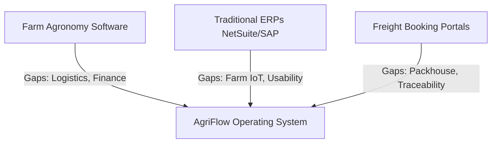

# AgriFlow: Investor Assessment & Market Sizing

This document presents the market sizing estimation, competitive advantage evaluation, scalability analysis, and strategic investment scorecard.

---

## 1. Market Size & Opportunity (TAM / SAM / SOM)

AgriFlow targets the global fresh produce supply chain, which is historically underserved by standard modern vertical SaaS platforms.

```
+-------------------------------------------------------------+
| TOTAL ADDRESSABLE MARKET (TAM)                              |
| Global Agri-Export Software & Logistics: $12.5 Billion      |
| +---------------------------------------------------------+ |
| | SERVICEABLE ADDRESSABLE MARKET (SAM)                    | |
| | Emerging Markets Agri-B2B SaaS: $3.2 Billion            | |
| | +-----------------------------------------------------+ | |
| | | SERVICEABLE OBTAINABLE MARKET (SOM)                 | | |
| | | India & SEA Fresh Produce Exporters: $350 Million   | | |
| | +-----------------------------------------------------+ | |
| +---------------------------------------------------------+ |
+-------------------------------------------------------------+
```

### TAM (Total Addressable Market): $12.5 Billion
* **Definition**: The global market for agricultural supply chain, farm management, and cold-chain logistics software services.
* **Calculation**: Valued based on the sum of global agricultural ERP spending, cold-chain IoT tracking software spending, and freight management software budgets globally.

### SAM (Serviceable Addressable Market): $3.2 Billion
* **Definition**: Exporters and large farming cooperatives in developing regions (such as India, Southeast Asia, and Latin America) that export high-value crops (e.g., Bananas, Mangoes, Grapes, Pomegranates) to premium international destinations.
* **Calculation**: Assumes standard SaaS operational spending parameters ($500 to $1,500/month per exporter account) applied to the estimated 300,000 active agricultural exporters in these regions.

### SOM (Serviceable Obtainable Market): $350 Million
* **Definition**: Fresh produce exporters operating in India, Vietnam, Thailand, and the Philippines whom AgriFlow can acquire via direct sales and partnership networks within the first 5 years.
* **Calculation**: Target capture of 10% of India and Southeast Asian fresh fruit/vegetable exporters, representing approximately 30,000 active accounts at an average contract value (ACV) of $11,000/year.

---

## 2. Product-Market Fit & Competitive Advantage

AgriFlow sits at the convergence of three separate tech stacks, providing a key operational moat:



### Core Moats & Competitive Advantages
1. **The Traceability Chain Moat**: By binding the initial harvest lot UUID to quality inspection parameters and the final shipping container ID, AgriFlow provides end-to-end traceability. This allows exporters to quickly defend themselves against quality claims from international buyers, saving thousands of dollars in disputed cargo.
2. **Built-in Compliance Rules Engine**: Unlike generic logistics platforms, AgriFlow contains destination-based phytosanitary and Maximum Residue Limit (MRL) checkers. It proactively flags non-compliant produce before it leaves the packing facility.
3. **Immersive Buyer Experience**: The interactive 3D React Three Fiber dashboard provides buyers with real-time transparency, replacing dozens of static emails and WhatsApp messages with a live digital portal.

---

## 3. Scalability Strategy
* **Database Partitioning**: The database design partitions telemetry metrics (`temp_humidity_logs`) by container ID and week, ensuring fast read times as the platform scales to millions of records.
* **Low-bandwidth Optimization**: The PWA mobile clients use local SQLite storage and compress data schemas, allowing farmers to record data in off-grid rural areas.
* **API Gateway Caching**: Gateway cache layers store market price indexes and static reports, reducing redundant hits on the core PostgreSQL database.

---

## 4. Strategic Scorecard

| Assessment Category | Score | Strategic Rationale & Evaluation |
| :--- | :---: | :--- |
| **Product Strength** | **9 / 10** | **Highly Specialized Vertical SaaS**: The platform directly addresses critical industry pain points (such as quality disputes, compliance checks, and fragmented logistics). The 3D visualization offers an excellent sales differentiator. |
| **Scalability** | **8 / 10** | **Solid Architectural Foundation**: The database schema and system architecture are designed to scale. Real-world physical dependencies (like manual packhouse entries and rural network limits) are mitigated by offline sync features, though they still represent operational constraints. |
| **Revenue Potential** | **9 / 10** | **Diverse Income Streams**: AgriFlow combines high-margin recurring SaaS subscriptions with transaction-based fees (such as IoT SIM markup, financial transactions, and buyer marketplace match commissions), leading to strong average revenue per account (ARPU). |
| **Investor Appeal** | **9 / 10** | **Large Untapped Market**: Agriculture is one of the last major global industries to undergo digitization. The clear value proposition (reducing crop spoilage and shipping errors) makes it a highly attractive target for venture capital and supply chain-focused funds. |
| **Overall Score** | **8.75 / 10** | **Strong Investment Opportunity**: AgriFlow represents a robust, highly defensible B2B enterprise SaaS opportunity with a large addressable market and clear paths to scalability. |
