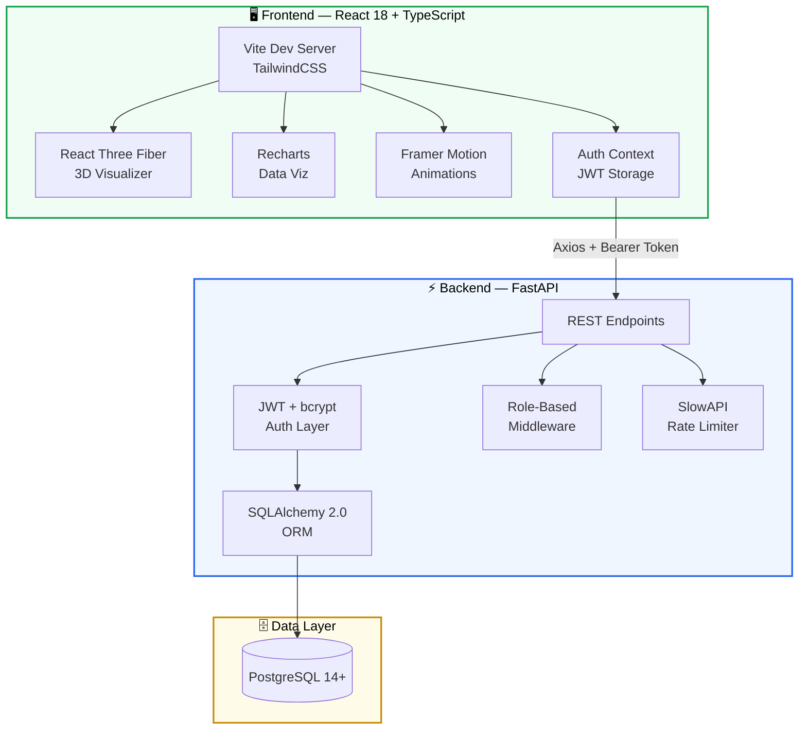
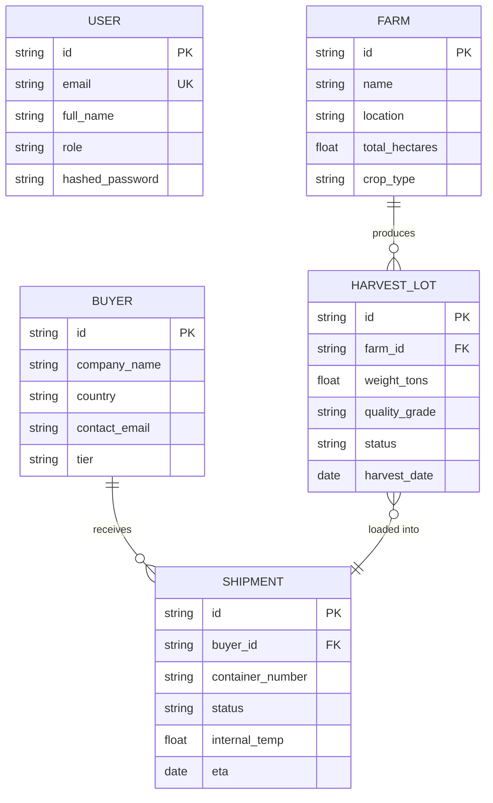
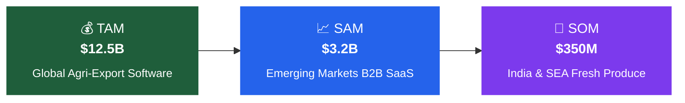

<div align="center">

<!-- HERO SECTION -->
<br />

```
     ___           _ ______ _               
    / _ \         (_)| ___| |              
   / /_\ \ __ _ _ __ | |_| | _____      __
   |  _  |/ _` | '__||  _| |/ _ \ \ /\ / /
   | | | | (_| | |   | | | | (_) \ V  V / 
   \_| |_/\__, |_|   \_| |_|\___/ \_/\_/  
           __/ |                            
          |___/                             
```

### **From Farm to Global Markets — One Connected Export Operating System**

<br />


<br />
<br />

AgriFlow is a full-stack enterprise SaaS platform that digitizes the agricultural export supply chain.<br/>
It replaces paper manifests, WhatsApp threads, and Excel spreadsheets with a single system<br/>
that tracks produce from harvest through cold storage, ocean freight, and international delivery.

<br />

[Features](#-key-features) · [Quick Start](#-quick-start) · [Architecture](#-system-architecture) · [Blueprint](#-product-blueprint) · [Security](#-security) · [Market](#-market-opportunity)

<br />

</div>

---

<br />

## 🎯 Key Features

<table>
<tr>
<td width="50%" valign="top">

<h3>🚢 3D Supply Chain Visualizer</h3>
<blockquote>
Interactive <strong>React Three Fiber</strong> scene with custom 3D geometry — cargo ships that bob on waves, warehouses, reefer containers, and farm silos. Orbit controls, status-driven coloring, and floating data cards. This is the product differentiator no competitor has.
</blockquote>

<h3>📊 Investor KPI Dashboard</h3>
<blockquote>
TAM/SAM/SOM market sizing ($12.5B → $350M) visualized with Recharts bar charts. Strategic radar scorecard rated <strong>8.75/10</strong>. Competitive moat analysis cards. Live simulated API telemetry with rate-limit demonstration.
</blockquote>

<h3>🔐 Enterprise RBAC</h3>
<blockquote>
Four roles — <strong>Admin, Farmer, Buyer, Operations</strong> — enforced at three layers: API middleware (FastAPI <code>Depends</code>), sidebar route filtering, and UI element gating. The "New Shipment" button is disabled with a tooltip for non-admin users, not a 403 surprise.
</blockquote>

</td>
<td width="50%" valign="top">

<h3>🌡️ Cold Chain Monitoring</h3>
<blockquote>
Reefer temperature tracking across active shipments. The command center surfaces real alerts from in-transit containers — not hardcoded data. Below-threshold temperatures trigger a red critical alert; in-range temps show an amber advisory.
</blockquote>

<h3>📋 Export Document Vault</h3>
<blockquote>
Phytosanitary certificates, bills of lading, commercial invoices, and packing lists — generated from shipment data with one-click PDF download. Destination-aware compliance flagging for MRL and customs requirements.
</blockquote>

<h3>🤖 AI-Powered Modules</h3>
<blockquote>
<strong>Quality Grading</strong> — AI defect detection with confidence scores and reject/accept logic.<br/>
<strong>Route Optimization</strong> — Multi-modal transport planning with cost, time, and carbon analysis.<br/>
<strong>Market Intelligence</strong> — Price trend forecasting with commodity-level breakdowns.
</blockquote>

</td>
</tr>
</table>

<br />

---

<br />

## 🚀 Quick Start

> **Three commands. Under three minutes.**

### Prerequisites

<table>
<tr>
<th align="left">Tool</th>
<th align="left">Version</th>
<th align="left">Install</th>
</tr>
<tr>
<td><strong>Node.js</strong></td>
<td><code>18+</code></td>
<td><a href="https://nodejs.org/">nodejs.org</a></td>
</tr>
<tr>
<td><strong>Python</strong></td>
<td><code>3.9+</code></td>
<td>Pre-installed on macOS</td>
</tr>
<tr>
<td><strong>PostgreSQL</strong></td>
<td><code>14+</code></td>
<td><a href="https://postgresapp.com/">Postgres.app</a> (Mac)</td>
</tr>
</table>

<br />

### Step 1 — Backend

```bash
cd backend
python3 -m venv venv && source venv/bin/activate
pip install -r requirements.txt

# Generate a secret key and start the server
export SECRET_KEY=$(python3 -c "import secrets; print(secrets.token_urlsafe(48))")
uvicorn app.main:app --reload
```

> ✅ API starts at **http://localhost:8000** — auto-creates tables and seeds 3 demo users on first boot.

### Step 2 — Frontend

```bash
cd client
npm install
npm run dev
```

> ✅ Frontend starts at **http://localhost:5173**

### Step 3 — Log in

Open the app and hit one of the **Quick Demo** buttons — no credentials to type:

<table>
<tr>
<th align="center">🔴 Admin</th>
<th align="center">🟢 Farmer</th>
<th align="center">🔵 Buyer</th>
</tr>
<tr>
<td align="center">All 12 modules<br/><sub>Farms, Packhouse, Shipments, Quality Control, Buyers CRM, Route Optimizer, Market Intel, Export Docs, Investor KPIs</sub></td>
<td align="center">Farm operations<br/><sub>Harvest lots, farm data, simplified dashboard</sub></td>
<td align="center">Trade view<br/><sub>Shipment tracking, delivery status</sub></td>
</tr>
</table>

<br />

---

<br />

## 🏗️ System Architecture



<br />

### 🔗 The Traceability Chain

> Every piece of produce gets a cryptographic identity at harvest and carries it through the entire export pipeline.

```mermaid
graph LR
    F["🌾 Farm<br/><sub>Crop Growth</sub>"] -->|"Harvest Lot ID"| H["📦 Harvest Lot<br/><sub>Weight + Grade</sub>"]
    H -->|"Inspection ID"| Q["✅ Quality Check<br/><sub>Grade A/B/C</sub>"]
    Q -->|"Batch ID"| P["📋 Packing<br/><sub>Cold Storage</sub>"]
    P -->|"Container ID"| S["🚢 Shipment<br/><sub>Ocean Freight</sub>"]
    S -->|"B/L Number"| B["🌍 Buyer<br/><sub>Delivery + Receipt</sub>"]

    style F fill:#1F5E3B,stroke:#1F5E3B,color:#fff
    style H fill:#1F5E3B,stroke:#1F5E3B,color:#fff
    style Q fill:#065f46,stroke:#065f46,color:#fff
    style P fill:#1e40af,stroke:#1e40af,color:#fff
    style S fill:#1E5EFF,stroke:#1E5EFF,color:#fff
    style B fill:#7c3aed,stroke:#7c3aed,color:#fff
```



<br />

### 🗂️ Database Schema (Simplified ERD)



<br />

---

<br />

## 📖 Product Blueprint

<blockquote>
Six documents. 74 pages of product strategy, UX specs, technical architecture, and investor analysis — all in this repo.
</blockquote>

<table>
<tr>
<th align="center">#</th>
<th>Document</th>
<th>What's Inside</th>
<th>For</th>
</tr>
<tr>
<td align="center"><strong>01</strong></td>
<td><a href="./01_product_strategy.md">📋 Product Strategy</a></td>
<td>Market analysis, SWOT matrix, risk mitigation, pricing tiers, 3-year roadmap</td>
<td><code>Founders</code> <code>PMs</code> <code>Investors</code></td>
</tr>
<tr>
<td align="center"><strong>02</strong></td>
<td><a href="./02_user_journey_rbac.md">👤 User Journey & RBAC</a></td>
<td>4-role permission matrix, information architecture, end-to-end user flows</td>
<td><code>PMs</code> <code>UX Designers</code></td>
</tr>
<tr>
<td align="center"><strong>03</strong></td>
<td><a href="./03_design_system_ux.md">🎨 Design System & UX</a></td>
<td>Typography, color palette, component library, 20+ screen specifications</td>
<td><code>UI/UX</code> <code>Frontend</code></td>
</tr>
<tr>
<td align="center"><strong>04</strong></td>
<td><a href="./04_technical_architecture.md">⚙️ Technical Architecture</a></td>
<td>PostgreSQL DDL, database ERD, REST API spec, security model</td>
<td><code>Architects</code> <code>Backend</code></td>
</tr>
<tr>
<td align="center"><strong>05</strong></td>
<td><a href="./05_advanced_features_ai.md">🤖 Advanced Features & AI</a></td>
<td>3D visualizer spec, notification engine, analytics, ML/AI roadmap</td>
<td><code>ML/AI</code> <code>Graphics</code></td>
</tr>
<tr>
<td align="center"><strong>06</strong></td>
<td><a href="./06_investor_assessment.md">💰 Investor Assessment</a></td>
<td>TAM/SAM/SOM ($12.5B → $350M), competitive moats, scorecard (8.75/10)</td>
<td><code>Founders</code> <code>Investors</code></td>
</tr>
</table>

<br />

---

<br />

## 🛠️ Tech Stack

<table>
<tr>
<td align="center" width="96">
<br /><strong>React</strong>
</td>
<td align="center" width="96">
<br /><strong>TypeScript</strong>
</td>
<td align="center" width="96">
<br /><strong>Three.js</strong>
</td>
<td align="center" width="96">
<br /><strong>Vite</strong>
</td>
<td align="center" width="96">
<br /><strong>Tailwind</strong>
</td>
<td align="center" width="96">
<br /><strong>FastAPI</strong>
</td>
<td align="center" width="96">
<br /><strong>PostgreSQL</strong>
</td>
<td align="center" width="96">
<br /><strong>Python</strong>
</td>
</tr>
</table>

<details>
<summary><strong>Full dependency breakdown</strong></summary>
<br />

| Layer | Technology | Purpose |
|:------|:-----------|:--------|
| **UI Framework** | React 18, TypeScript | Component architecture, type safety |
| **Build Tool** | Vite 5 | Hot module replacement, fast builds |
| **3D Engine** | React Three Fiber, Three.js, Drei | 3D supply chain visualizer |
| **Charts** | Recharts | Market sizing, radar scorecard, KPI graphs |
| **Animation** | Framer Motion | Page transitions, micro-interactions |
| **Styling** | TailwindCSS | Utility-first design system |
| **API Framework** | FastAPI 0.110 | Async REST endpoints, auto-docs |
| **ORM** | SQLAlchemy 2.0, Alembic | Database models, migrations |
| **Validation** | Pydantic v2 | Request/response schema enforcement |
| **Auth** | python-jose (JWT), bcrypt | Token generation, password hashing |
| **Rate Limiting** | SlowAPI | DDoS protection, login throttling |
| **Database** | PostgreSQL 14+ | Relational data, partitioned telemetry |

</details>

<br />

---

<br />

## 📂 Project Structure

```
AgriFlow/
│
├── 📁 client/                           React frontend (Vite)
│   ├── 📁 src/
│   │   ├── 📁 pages/
│   │   │   ├── Dashboard.tsx            Command center — KPI cards, alerts, harvest table
│   │   │   ├── ShipmentsTracker.tsx     ★ 3D supply chain visualizer (React Three Fiber)
│   │   │   ├── Farms.tsx                Farm management — CRUD, location, crop types
│   │   │   ├── Packhouse.tsx            Cold storage — lot registration, status pipeline
│   │   │   ├── BuyersCRM.tsx            Buyer relationships — contracts, tiers
│   │   │   ├── QualityGrading.tsx       AI quality inspection — defect scoring
│   │   │   ├── RouteOptimization.tsx    AI route planner — cost, time, carbon
│   │   │   ├── MarketIntelligence.tsx   Price trends — forecasting, commodity analysis
│   │   │   ├── InvestorDashboard.tsx    KPI scorecard — TAM/SAM/SOM, radar chart
│   │   │   ├── ExportDocument.tsx       Certificate generator — phyto, invoice, B/L
│   │   │   ├── ExportReport.tsx         Executive summary — aggregate metrics
│   │   │   └── Login.tsx                Auth — one-click demo buttons, no plaintext creds
│   │   ├── 📁 components/
│   │   │   ├── DashboardLayout.tsx      Sidebar nav, breadcrumbs, role-aware filtering
│   │   │   └── FarmerDashboard.tsx      Farmer-specific simplified command center
│   │   ├── 📁 context/
│   │   │   └── AuthContext.tsx          JWT token management, auth state, logout
│   │   └── 📁 services/
│   │       └── api.ts                   Axios HTTP client, interceptors, error handling
│   └── package.json
│
├── 📁 backend/                          FastAPI backend
│   ├── 📁 app/
│   │   ├── main.py                      Routes, RBAC guards, startup seeding
│   │   ├── models.py                    SQLAlchemy ORM — User, Farm, HarvestLot, Shipment, Buyer
│   │   ├── schemas.py                   Pydantic v2 — request/response validation
│   │   ├── auth.py                      JWT creation, bcrypt hashing, token decode
│   │   └── database.py                  PostgreSQL engine, session factory, connection pool
│   ├── requirements.txt                 12 pinned dependencies
│   └── .env.example                     Environment variable template
│
├── 01_product_strategy.md               Market analysis, SWOT, commercialization
├── 02_user_journey_rbac.md              Role matrix, user flows
├── 03_design_system_ux.md               Typography, colors, 20+ screen specs
├── 04_technical_architecture.md         PostgreSQL DDL, API spec, security
├── 05_advanced_features_ai.md           3D viz, notifications, ML roadmap
├── 06_investor_assessment.md            TAM/SAM/SOM, scorecard (8.75/10)
└── README.md                            ← You are here
```

<br />

---

<br />

## 🔒 Security

<table>
<tr>
<td width="40"><strong>🔑</strong></td>
<td><strong>Authentication</strong></td>
<td>JWT tokens (7-day expiry) + bcrypt password hashing. No plaintext credentials anywhere in the UI.</td>
</tr>
<tr>
<td><strong>🛡️</strong></td>
<td><strong>Authorization</strong></td>
<td>Role-based access control enforced at API layer (<code>Depends(require_write_role)</code>), route layer (sidebar filtering), and UI layer (disabled buttons with tooltips).</td>
</tr>
<tr>
<td><strong>⏱️</strong></td>
<td><strong>Rate Limiting</strong></td>
<td>Login: <code>5 req/min</code>. Global API: <code>100 req/min</code>. Powered by SlowAPI.</td>
</tr>
<tr>
<td><strong>🔐</strong></td>
<td><strong>Secrets</strong></td>
<td><code>SECRET_KEY</code> loaded from environment. <code>.env</code> is gitignored. Template provided in <code>.env.example</code>.</td>
</tr>
<tr>
<td><strong>🌐</strong></td>
<td><strong>CORS</strong></td>
<td>Whitelisted origins only: <code>localhost:5173</code>, <code>localhost:5174</code>, <code>localhost:3000</code>.</td>
</tr>
</table>

<br />

---

<br />

## 📊 Market Opportunity

<div align="center">



</div>

<table align="center">
<tr>
<th>Metric</th>
<th>Value</th>
</tr>
<tr><td>Total Addressable Market</td><td><strong>$12.5 Billion</strong></td></tr>
<tr><td>Serviceable Addressable Market</td><td><strong>$3.2 Billion</strong></td></tr>
<tr><td>Serviceable Obtainable Market</td><td><strong>$350 Million</strong></td></tr>
<tr><td>Target ACV per Account</td><td><strong>$11,000/year</strong></td></tr>
<tr><td>Strategic Scorecard</td><td><strong>8.75 / 10</strong></td></tr>
</table>

<br />

### Competitive Moats

| Moat | Why It Matters |
|:-----|:---------------|
| **🔗 Traceability Chain** | End-to-end UUID binding from harvest lot → quality report → container → B/L. Exporters can defend against quality claims in minutes, not weeks. |
| **📋 Built-in Compliance** | Destination-aware phytosanitary and MRL checkers flag non-compliant produce before it leaves the packing facility. |
| **🚢 3D Buyer Portal** | Interactive transit visualization replaces dozens of static emails and WhatsApp messages with a live digital experience. |

<br />

---

<br />

<div align="center">

### Built for the agricultural export industry.

The world's food supply chain moves $1.4 trillion in trade annually.<br />
Most of it is tracked on paper, WhatsApp, and Excel.<br />
AgriFlow is what happens when you decide that's not good enough.

<br />

<sub>Made with conviction and too much coffee. ☕</sub>

<br />
<br />

</div>
