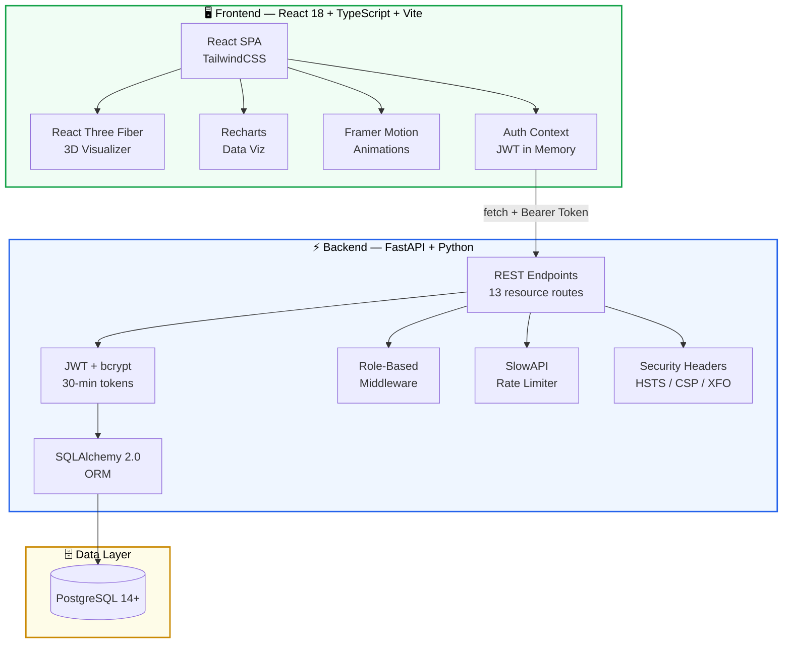
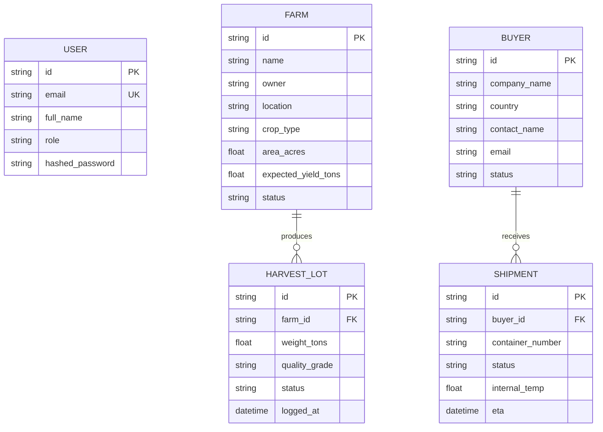
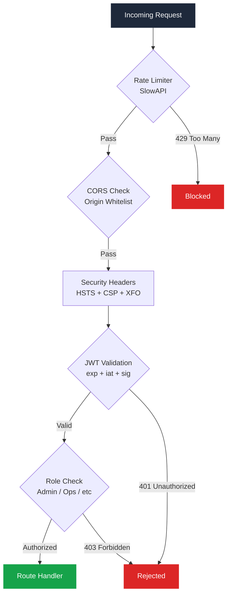
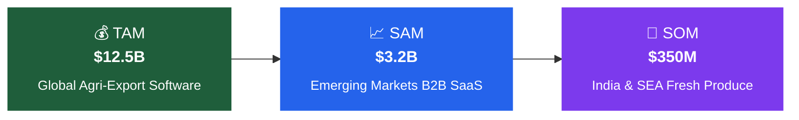

<div align="center">

<!-- HERO SECTION -->
<br />

```
     ___           _ ______ _               
    / _ \         (_)| ___| |              
   / /_\ \ __ _ _ __ | |_| | _____      __
   |  _  |/ _` | '__||  _| |/ _ \ \ /\ / /
   | | | | (_| | |   | | | | (_) \ V  V / 
   \_| |_/\__, |_|   \_| |_|\___/ \_/\_/  
           __/ |                            
          |___/                             
```

### **From Farm to Global Markets — One Connected Export Operating System**

<br />


<br />
<br />

AgriFlow is a full-stack enterprise SaaS platform that digitizes the agricultural export supply chain.<br/>
It replaces paper manifests, WhatsApp threads, and Excel spreadsheets with a single system<br/>
that tracks produce from harvest through cold storage, ocean freight, and international delivery.

<br />

[Features](#-key-features) · [Quick Start](#-quick-start) · [Architecture](#-system-architecture) · [Security](#-security-architecture) · [Blueprint](#-product-blueprint) · [Market](#-market-opportunity)

<br />

</div>

---

<br />

## 🎯 Key Features

<table>
<tr>
<td width="50%" valign="top">

<h3>🚢 3D Supply Chain Visualizer</h3>
<blockquote>
Interactive <strong>React Three Fiber</strong> scene with custom 3D geometry — cargo ships, warehouses, reefer containers, and farm silos. Orbit controls, status-driven coloring, and floating data cards. Real shipment data from the API drives every visual element.
</blockquote>

<h3>📊 Command Center Dashboard</h3>
<blockquote>
Real-time KPI cards pulling live data from PostgreSQL — active farms, harvest lots, storage utilization, and shipment status. Every card is <strong>clickable</strong> and navigates to the relevant detail page. Numbers stay consistent across all views.
</blockquote>

<h3>🔐 Hardened Authentication & RBAC</h3>
<blockquote>
Five roles — <strong>Admin, Operations, Farmer, Buyer, Exporter</strong> — enforced at three layers: API middleware (<code>Depends</code>), sidebar route filtering, and UI element gating. Server-assigned roles only (no client-side role selection). Admin-only user management panel. First-user bootstrap creates the initial Admin automatically.
</blockquote>

</td>
<td width="50%" valign="top">

<h3>🌡️ Cold Chain & Packhouse Operations</h3>
<blockquote>
Kanban-style lot pipeline (Intake → Quality → Packing → Storage) with real-time capacity metrics. Cold storage table view toggle. Chiller temperature monitoring. Storage utilization synced across Dashboard and Packhouse views.
</blockquote>

<h3>📋 Export Document Vault</h3>
<blockquote>
Phytosanitary certificates, bills of lading, commercial invoices, and packing lists — generated from shipment data with one-click PDF download. Destination-aware compliance flagging for MRL and customs requirements.
</blockquote>

<h3>🤖 AI-Powered Modules</h3>
<blockquote>
<strong>Quality Grading</strong> — MRL chemical testing with realistic simulated lab results per lot, pass/fail compliance against EU/US/JP limits.<br/>
<strong>Route Optimization</strong> — Multi-modal transport planning with cost, time, and carbon analysis.<br/>
<strong>Market Intelligence</strong> — Price trend forecasting with commodity-level breakdowns.
</blockquote>

</td>
</tr>
</table>

<br />

### 📦 All 15 Modules

| Module | Description |
|:-------|:------------|
| **Dashboard** | Command center with live KPI cards, harvest table, alerts |
| **Farms** | Farm CRUD — name, location, crop type, expected yield |
| **Packhouse** | Kanban pipeline, cold storage table, capacity monitoring |
| **Shipments** | 3D supply chain visualizer + shipment tracking |
| **Buyers CRM** | Buyer management, active shipment / delivery metrics |
| **Quality Grading** | MRL chemical testing, physical grading, compliance |
| **Route Optimizer** | AI rerouting engine, spoilage risk, alternative ports |
| **Market Intel** | Commodity price trends, demand forecasting |
| **Export Documents** | Certificate generation — phyto, B/L, invoices |
| **Export Report** | Executive summary with aggregate metrics |
| **Investor KPIs** | TAM/SAM/SOM, radar scorecard, competitive moats |
| **Settings** | Profile management, password change with strength validation |
| **Login** | JWT authentication with demo quick-access buttons |
| **Register** | Secure registration with password strength meter |
| **Admin Panel** | User listing + role management (Admin-only) |

<br />

---

<br />

## 🚀 Quick Start

> **Three commands. Under three minutes.**

### Prerequisites

<table>
<tr>
<th align="left">Tool</th>
<th align="left">Version</th>
<th align="left">Install</th>
</tr>
<tr>
<td><strong>Node.js</strong></td>
<td><code>18+</code></td>
<td><a href="https://nodejs.org/">nodejs.org</a></td>
</tr>
<tr>
<td><strong>Python</strong></td>
<td><code>3.9+</code></td>
<td>Pre-installed on macOS</td>
</tr>
<tr>
<td><strong>PostgreSQL</strong></td>
<td><code>14+</code></td>
<td><a href="https://postgresapp.com/">Postgres.app</a> (Mac)</td>
</tr>
</table>

<br />

### Step 1 — Clone & Backend

```bash
git clone https://github.com/omrajput14/agriflow.git
cd agriflow/backend

# Set up virtual environment
python3 -m venv venv && source venv/bin/activate
pip install -r requirements.txt

# Configure secrets (NEVER commit .env)
cp .env.example .env
# Edit .env and set SECRET_KEY:
#   python3 -c "import secrets; print(secrets.token_urlsafe(48))"

# Start the API server
uvicorn app.main:app --reload
```

> ✅ API starts at **http://localhost:8000** — auto-creates tables on first boot.

### Step 2 — Frontend

```bash
cd client
npm install
npm run dev
```

> ✅ Frontend starts at **http://localhost:5173**

### Step 3 — Register & Log In

1. Go to `/register` — the **first user** automatically becomes **Admin**
2. Subsequent registrations are assigned the `Pending` role
3. Admin can promote users via `Settings → User Management`

> ⚠️ **Passwords must be ≥ 10 characters** and pass server-side strength validation (common password rejection, email/name match check).

<br />

---

<br />

## 🏗️ System Architecture



<br />

### 🔗 The Traceability Chain

> Every piece of produce gets a unique identity at harvest and carries it through the entire export pipeline.


<br />

### 🗂️ Database Schema



<br />

---

<br />

## 🔒 Security Architecture

AgriFlow implements defense-in-depth with hardened authentication at every layer.



<br />

<table>
<tr>
<th width="180">Layer</th>
<th>Implementation</th>
</tr>
<tr>
<td><strong>🔑 Authentication</strong></td>
<td>JWT tokens with <strong>30-minute expiry</strong> + <code>iat</code> claim. bcrypt password hashing (cost factor 12). No plaintext credentials in UI, logs, or error messages.</td>
</tr>
<tr>
<td><strong>🛡️ Authorization</strong></td>
<td>Server-assigned roles only — registration always assigns <code>Pending</code> (first user auto-promoted to <code>Admin</code>). Admin-only <code>PATCH /api/admin/users/{id}/role</code> endpoint for role upgrades. Role whitelist validation via Pydantic.</td>
</tr>
<tr>
<td><strong>🔒 Password Policy</strong></td>
<td>Minimum 10 characters. Rejects top-110 common passwords. Rejects email/name as password. Frontend strength meter (5-bar visual) with server-side re-validation.</td>
</tr>
<tr>
<td><strong>⏱️ Rate Limiting</strong></td>
<td>Login: <code>5 per 15 min</code>. Registration: <code>3 per hour</code>. Global API: <code>100/min</code>. IP-based keying via SlowAPI.</td>
</tr>
<tr>
<td><strong>🕵️ Anti-Enumeration</strong></td>
<td>Login: <code>"Invalid email or password"</code> for both bad email and bad password. Registration: identical success response whether email exists or not.</td>
</tr>
<tr>
<td><strong>🔐 Secrets</strong></td>
<td><code>SECRET_KEY</code> loaded from env vars. <code>.env</code> in both root and backend <code>.gitignore</code>. Template provided in <code>.env.example</code>.</td>
</tr>
<tr>
<td><strong>🌐 CORS</strong></td>
<td>Explicit origin whitelist only — no wildcard with credentials. No regex patterns.</td>
</tr>
<tr>
<td><strong>📋 Security Headers</strong></td>
<td><code>Strict-Transport-Security</code>, <code>X-Content-Type-Options: nosniff</code>, <code>X-Frame-Options: DENY</code>, <code>Content-Security-Policy</code>, <code>Referrer-Policy</code></td>
</tr>
<tr>
<td><strong>✏️ Input Validation</strong></td>
<td>Pydantic <code>EmailStr</code> for email format. Name fields: 2–100 chars, HTML tag rejection. Container numbers: regex format validation. All queries via SQLAlchemy ORM (no SQL injection).</td>
</tr>
<tr>
<td><strong>📊 Audit Logging</strong></td>
<td>Structured auth events: <code>AUTH_LOGIN_SUCCESS</code>, <code>AUTH_LOGIN_FAILED</code>, <code>AUTH_REGISTER_*</code>, <code>AUTH_ROLE_CHANGED</code>, <code>AUTH_PASSWORD_CHANGED</code> — with IP, user ID, timestamps. <strong>Never logs passwords or tokens.</strong></td>
</tr>
</table>

<br />

---

<br />

## 🛠️ Tech Stack

<table>
<tr>
<td align="center" width="96">
<br /><strong>React</strong>
</td>
<td align="center" width="96">
<br /><strong>TypeScript</strong>
</td>
<td align="center" width="96">
<br /><strong>Three.js</strong>
</td>
<td align="center" width="96">
<br /><strong>Vite</strong>
</td>
<td align="center" width="96">
<br /><strong>Tailwind</strong>
</td>
<td align="center" width="96">
<br /><strong>FastAPI</strong>
</td>
<td align="center" width="96">
<br /><strong>PostgreSQL</strong>
</td>
<td align="center" width="96">
<br /><strong>Python</strong>
</td>
</tr>
</table>

<details>
<summary><strong>Full dependency breakdown</strong></summary>
<br />

| Layer | Technology | Purpose |
|:------|:-----------|:--------|
| **UI Framework** | React 18, TypeScript | Component architecture, type safety |
| **Build Tool** | Vite 5 | Hot module replacement, fast builds |
| **3D Engine** | React Three Fiber, Three.js, Drei | 3D supply chain visualizer |
| **Charts** | Recharts | Market sizing, radar scorecard, KPI graphs |
| **Animation** | Framer Motion | Page transitions, micro-interactions |
| **Styling** | TailwindCSS | Utility-first design system |
| **API Framework** | FastAPI 0.110 | Async REST endpoints, auto-docs at `/docs` |
| **ORM** | SQLAlchemy 2.0, Alembic | Database models, migrations |
| **Validation** | Pydantic v2 + EmailStr | Request/response schema enforcement |
| **Auth** | python-jose (JWT), bcrypt (cost 12) | 30-min token generation, password hashing |
| **Rate Limiting** | SlowAPI | Brute-force protection, registration throttling |
| **Security** | Custom middleware | HSTS, CSP, XFO, nosniff headers |
| **Database** | PostgreSQL 14+ | Relational data with foreign key integrity |

</details>

<br />

---

<br />

## 📂 Project Structure

```
AgriFlow/
│
├── 📁 client/                           React frontend (Vite + TypeScript)
│   ├── 📁 src/
│   │   ├── 📁 pages/
│   │   │   ├── Dashboard.tsx            Command center — live KPI cards, alerts, harvest table
│   │   │   ├── ShipmentsTracker.tsx     ★ 3D supply chain visualizer (React Three Fiber)
│   │   │   ├── Farms.tsx                Farm CRUD — create, edit, delete with validation
│   │   │   ├── Packhouse.tsx            Kanban pipeline + cold storage table toggle
│   │   │   ├── BuyersCRM.tsx            Buyer management — shipment metrics, delete
│   │   │   ├── QualityGrading.tsx       MRL chemical testing — simulated lab results per lot
│   │   │   ├── RouteOptimization.tsx    AI route planner — cost, time, carbon analysis
│   │   │   ├── MarketIntelligence.tsx   Price trends — forecasting, commodity breakdown
│   │   │   ├── InvestorDashboard.tsx    KPI scorecard — TAM/SAM/SOM, radar chart
│   │   │   ├── ExportDocument.tsx       Certificate generator — phyto, invoice, B/L
│   │   │   ├── ExportReport.tsx         Executive summary — aggregate metrics
│   │   │   ├── Settings.tsx             Profile + password management
│   │   │   ├── Login.tsx                JWT auth — demo quick-access buttons
│   │   │   └── Register.tsx             Secure signup — strength meter, no role dropdown
│   │   ├── 📁 components/
│   │   │   ├── DashboardLayout.tsx      Sidebar nav, breadcrumbs, role-aware filtering
│   │   │   └── FarmerDashboard.tsx      Farmer-specific simplified command center
│   │   ├── 📁 context/
│   │   │   └── AuthContext.tsx          JWT management, auth state, protected routes
│   │   └── 📁 services/
│   │       └── api.ts                   HTTP client — typed endpoints, error handling
│   └── package.json
│
├── 📁 backend/                          FastAPI backend (Python 3.9+)
│   ├── 📁 app/
│   │   ├── main.py                      Routes, RBAC guards, admin endpoints, security middleware
│   │   ├── models.py                    SQLAlchemy ORM — User, Farm, HarvestLot, Shipment, Buyer
│   │   ├── schemas.py                   Pydantic v2 — input validation, EmailStr, role whitelist
│   │   ├── auth.py                      JWT creation (30-min), bcrypt (cost 12), token decode
│   │   ├── common_passwords.py          Top 110 common passwords for server-side rejection
│   │   └── database.py                  PostgreSQL engine, session factory, connection pool
│   ├── requirements.txt                 13 pinned dependencies
│   ├── .env.example                     Environment variable template (SECRET_KEY, DATABASE_URL)
│   └── .gitignore                       Excludes .env, venv, __pycache__
│
├── 📄 01_product_strategy.md            Market analysis, SWOT, commercialization
├── 📄 02_user_journey_rbac.md           Role matrix, user flows
├── 📄 03_design_system_ux.md            Typography, colors, 20+ screen specs
├── 📄 04_technical_architecture.md      PostgreSQL DDL, API spec, security
├── 📄 05_advanced_features_ai.md        3D viz, notifications, ML roadmap
├── 📄 06_investor_assessment.md         TAM/SAM/SOM, scorecard (8.75/10)
├── .gitignore                           Root-level — excludes .env globally
└── README.md                            ← You are here
```

<br />

---

<br />

## 🔌 API Reference

All endpoints require JWT authentication unless noted. Full interactive docs at `http://localhost:8000/docs`.

### Auth Endpoints

| Method | Endpoint | Auth | Rate Limit | Description |
|:-------|:---------|:-----|:-----------|:------------|
| `POST` | `/api/auth/register` | — | 3/hour | Create account (server assigns role) |
| `POST` | `/api/auth/login` | — | 5/15min | Returns JWT access token |
| `GET` | `/api/auth/me` | ✅ | — | Current user profile |
| `PATCH` | `/api/auth/update-profile` | ✅ | — | Update name/email/password |

### Admin Endpoints (Admin-only)

| Method | Endpoint | Description |
|:-------|:---------|:------------|
| `GET` | `/api/admin/users` | List all users with roles |
| `PATCH` | `/api/admin/users/{id}/role` | Change user role (validated whitelist) |

### Resource Endpoints

| Method | Endpoint | Auth | Description |
|:-------|:---------|:-----|:------------|
| `GET/POST` | `/api/farms` | ✅ | List / create farms |
| `DELETE` | `/api/farms/{id}` | ✅ Admin/Ops | Delete a farm |
| `GET/POST` | `/api/lots` | ✅ | List / create harvest lots |
| `PATCH` | `/api/lots/{id}/status` | ✅ Admin/Ops | Update lot pipeline status |
| `GET/POST` | `/api/buyers` | ✅ | List / create buyers |
| `DELETE` | `/api/buyers/{id}` | ✅ Admin/Ops | Delete a buyer |
| `GET/POST` | `/api/shipments` | ✅ | List / create shipments |

<br />

---

<br />

## 📖 Product Blueprint

<blockquote>
Six documents. 74 pages of product strategy, UX specs, technical architecture, and investor analysis — all in this repo.
</blockquote>

<table>
<tr>
<th align="center">#</th>
<th>Document</th>
<th>What's Inside</th>
<th>For</th>
</tr>
<tr>
<td align="center"><strong>01</strong></td>
<td><a href="./01_product_strategy.md">📋 Product Strategy</a></td>
<td>Market analysis, SWOT matrix, risk mitigation, pricing tiers, 3-year roadmap</td>
<td><code>Founders</code> <code>PMs</code> <code>Investors</code></td>
</tr>
<tr>
<td align="center"><strong>02</strong></td>
<td><a href="./02_user_journey_rbac.md">👤 User Journey & RBAC</a></td>
<td>5-role permission matrix, information architecture, end-to-end user flows</td>
<td><code>PMs</code> <code>UX Designers</code></td>
</tr>
<tr>
<td align="center"><strong>03</strong></td>
<td><a href="./03_design_system_ux.md">🎨 Design System & UX</a></td>
<td>Typography, color palette, component library, 20+ screen specifications</td>
<td><code>UI/UX</code> <code>Frontend</code></td>
</tr>
<tr>
<td align="center"><strong>04</strong></td>
<td><a href="./04_technical_architecture.md">⚙️ Technical Architecture</a></td>
<td>PostgreSQL DDL, database ERD, REST API spec, security model</td>
<td><code>Architects</code> <code>Backend</code></td>
</tr>
<tr>
<td align="center"><strong>05</strong></td>
<td><a href="./05_advanced_features_ai.md">🤖 Advanced Features & AI</a></td>
<td>3D visualizer spec, notification engine, analytics, ML/AI roadmap</td>
<td><code>ML/AI</code> <code>Graphics</code></td>
</tr>
<tr>
<td align="center"><strong>06</strong></td>
<td><a href="./06_investor_assessment.md">💰 Investor Assessment</a></td>
<td>TAM/SAM/SOM ($12.5B → $350M), competitive moats, scorecard (8.75/10)</td>
<td><code>Founders</code> <code>Investors</code></td>
</tr>
</table>

<br />

---

<br />

## 📊 Market Opportunity

<div align="center">



</div>

<table align="center">
<tr>
<th>Metric</th>
<th>Value</th>
</tr>
<tr><td>Total Addressable Market</td><td><strong>$12.5 Billion</strong></td></tr>
<tr><td>Serviceable Addressable Market</td><td><strong>$3.2 Billion</strong></td></tr>
<tr><td>Serviceable Obtainable Market</td><td><strong>$350 Million</strong></td></tr>
<tr><td>Target ACV per Account</td><td><strong>$11,000/year</strong></td></tr>
<tr><td>Strategic Scorecard</td><td><strong>8.75 / 10</strong></td></tr>
</table>

<br />

### Competitive Moats

| Moat | Why It Matters |
|:-----|:---------------|
| **🔗 Traceability Chain** | End-to-end ID binding from harvest lot → quality report → container → B/L. Exporters can defend against quality claims in minutes, not weeks. |
| **📋 Built-in Compliance** | Destination-aware phytosanitary and MRL checkers flag non-compliant produce before it leaves the packing facility. |
| **🚢 3D Buyer Portal** | Interactive transit visualization replaces dozens of static emails and WhatsApp messages with a live digital experience. |
| **🔒 Enterprise Security** | Hardened auth with server-assigned roles, common password rejection, rate limiting, and structured audit logging — production-ready from day one. |

<br />

---

<br />

## 🗺️ Roadmap

| Phase | Status | Features |
|:------|:-------|:---------|
| **v1.0 — Core Platform** | ✅ Complete | Farm CRUD, Packhouse Kanban, Shipment tracker, Buyers CRM, Export docs, Dashboard |
| **v1.1 — Security Hardening** | ✅ Complete | RBAC overhaul, password policies, rate limiting, security headers, audit logging |
| **v1.2 — Data Integrity** | ✅ Complete | Cross-page KPI consistency, container validation, realistic MRL testing |
| **v2.0 — Session Management** | 🔜 Next | Refresh tokens (httpOnly cookies), token rotation, server-side revocation |
| **v2.1 — Email Flows** | 📋 Planned | Email verification, password reset, notification engine |
| **v3.0 — Advanced Security** | 📋 Planned | TOTP 2FA for Admin/Exporter, session device management, CAPTCHA on lockout |

<br />

---

<br />

<div align="center">

### Built for the agricultural export industry.

The world's food supply chain moves $1.4 trillion in trade annually.<br />
Most of it is tracked on paper, WhatsApp, and Excel.<br />
AgriFlow is what happens when you decide that's not good enough.

<br />

<sub>Made with conviction and too much coffee. ☕</sub>

<br />
<br />

</div>
