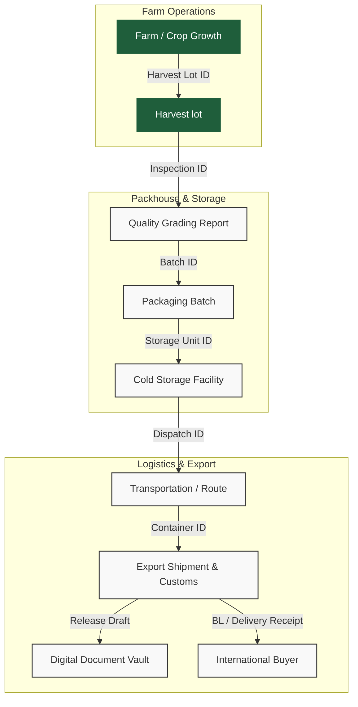

# AgriFlow Enterprise SaaS Product Blueprint
> **From Farm to Global Markets — One Connected Export Operating System**

Welcome to the AgriFlow Enterprise SaaS Product Blueprint. This repository contains the complete, production-ready specifications, design guidelines, and architectures for digitizing the global agricultural export supply chain. 

This document acts as the master entry point and table of contents for the complete blueprint suite.

---

## 📂 Blueprint Directory Structure

The blueprint is organized into the following modular files, optimized for product, design, engineering, and investment stakeholders:

| Document | Module Coverage | Target Audience |
| :--- | :--- | :--- |
| **[01. Product Strategy & Commercialization](file:///Users/0mrajput/Desktop/hoilday projects /AgriFlow/01_product_strategy.md)** | Product Analysis, Market Analysis, SWOT, Risks & Mitigations, SaaS Commercialization, & Roadmap | Founders, Product Managers, Exporter Execs, Investors |
| **[02. User Journey & RBAC Matrix](file:///Users/0mrajput/Desktop/hoilday projects /AgriFlow/02_user_journey_rbac.md)** | Detailed Role-Based Access Control, Information Architecture, & End-to-End User Journeys | Product Managers, UX Designers, Operations Managers |
| **[03. Design System & Screen UX Spec](file:///Users/0mrajput/Desktop/hoilday projects /AgriFlow/03_design_system_ux.md)** | Typography, Color Palette, Component Spec, Dashboard Widgets, & 20+ Detailed Screens UX Specs | UI/UX Designers, Frontend Engineers, Tech Leads |
| **[04. Technical Architecture & Database Design](file:///Users/0mrajput/Desktop/hoilday projects /AgriFlow/04_technical_architecture.md)** | PostgreSQL Schema DDL, Database ERD (Mermaid), Backend Design, REST API, & Security Specification | Solutions Architects, Backend Engineers, DevOps |
| **[05. Advanced Features & AI Engine](file:///Users/0mrajput/Desktop/hoilday projects /AgriFlow/05_advanced_features_ai.md)** | Three.js Supply Chain Visualizer, Notification Architecture, Analytics Engine, & AI/ML Roadmap | Graphics Engineers, ML/AI Engineers, Data Analysts |
| **[06. Investor Assessment & Scorecard](file:///Users/0mrajput/Desktop/hoilday projects /AgriFlow/06_investor_assessment.md)** | TAM/SAM/SOM, Competitive Analysis, Product Scorecard, & Investment Evaluation | Founders, Investors, Advisory Boards |

---

## 🌾 Core Vision: The Connected Farm-to-Port Traceability Chain

AgriFlow acts as a single source of truth that connects every link of the export chain, transforming paper, WhatsApp messages, and spreadsheets into clean, queryable relational data models.

For a detailed breakdown of each module's functionality, proceed to [01. Product Strategy & Commercialization](file:///Users/0mrajput/Desktop/hoilday projects /AgriFlow/01_product_strategy.md).
